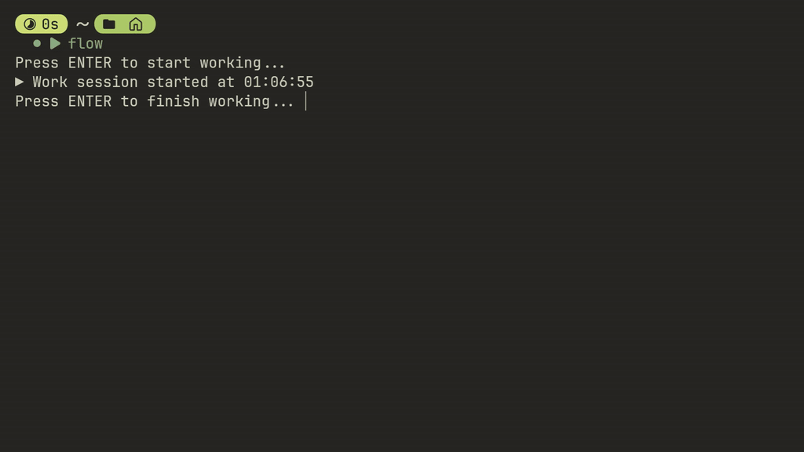

# fish-flowmodoro
Stay focused and balanced — a Fish Shell productivity timer with audio cues and progress summaries.
# 🐟 fish-flowmodoro

**Stay focused and balanced — a Fish Shell productivity timer with audio cues and progress summaries.**

---

## 🔧 Requirements (Arch Linux)

Before using Flowmodoro, ensure the following are installed:

### 1. **Fish Shell**
```bash
sudo pacman -S fish
````

### 2. **MPV** (for audio playback)

```bash
sudo pacman -S mpv
```

### 3. **timer-bin** 

```bash
yay -S timer-bin
```

### 4. **Optional: Make Fish your default shell**

```bash
chsh -s (which fish)
```

---

## ⚙️ Setup Instructions

### 1️⃣ Save the script to your Fish config

# Create the functions directory if it doesn't exist
```bash
mkdir -p ~/.config/fish/functions
```

# Save the script as flowmodoro.fish
```bash
nano ~/.config/fish/functions/flowmodoro.fish
```

### 2️⃣ Create the audio directory and add your sound files

```bash
mkdir -p ~/Music/
```

Add the following `.wav` files to `~/Music/`:

* `startwork.wav`
* `workstatus.wav`
* `startbreak.wav`
* `breakstatus.wav`
* `focus.wav`
* `welltried.wav`
* `didgreat.wav`

  ```bash
  cd sounds
  ```

  ```bash
  mv  * ~/Music

### 3️⃣ Reload Fish configuration

```bash
source ~/.config/fish/config.fish
```
# Or restart your terminal

---

## 🚀 Usage

Run Flowmodoro from your terminal:

```bash
flow
```
# or
```bash
flowmodoro
```

Follow the prompts to start work sessions, take breaks, and track progress.
Audio cues and summaries will guide your productivity.

---


This project was inspired by the terminal productivity workflows shown in this  [video](https://youtu.be/GfQjJBtO-8Y?si=j3YaV0F1K6qyR5LK) and their amazing [`.zshrc`](https://github.com/bashbunni/.zshrc). I decided to make my own version with some new ideas and custom touches!
